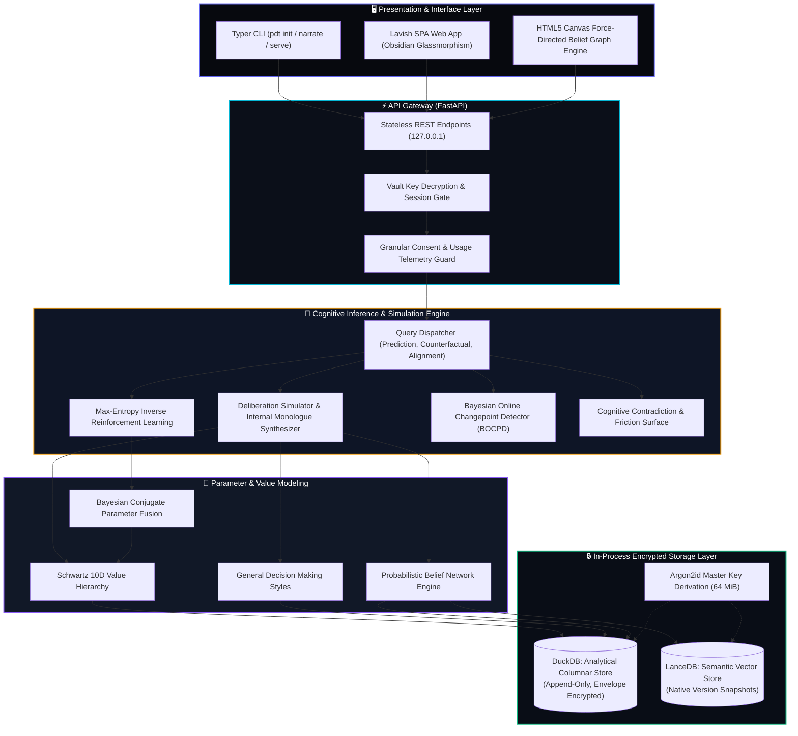
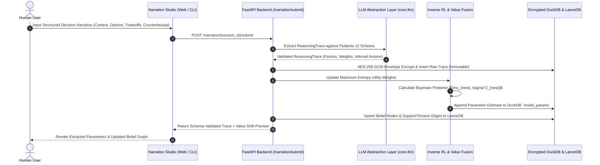
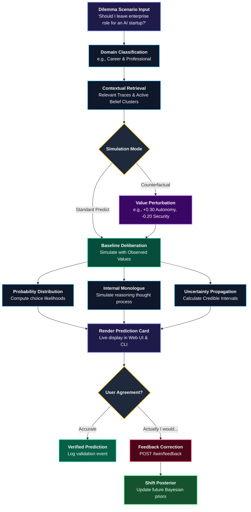
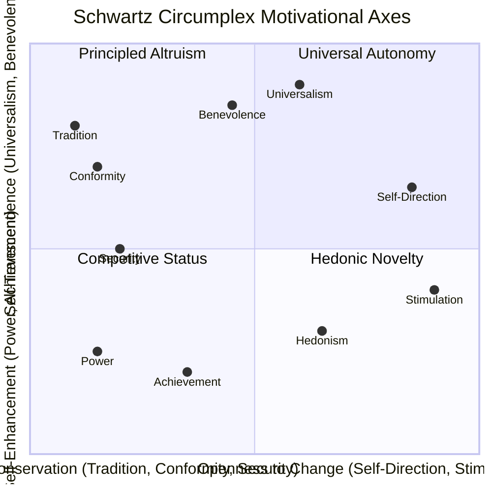
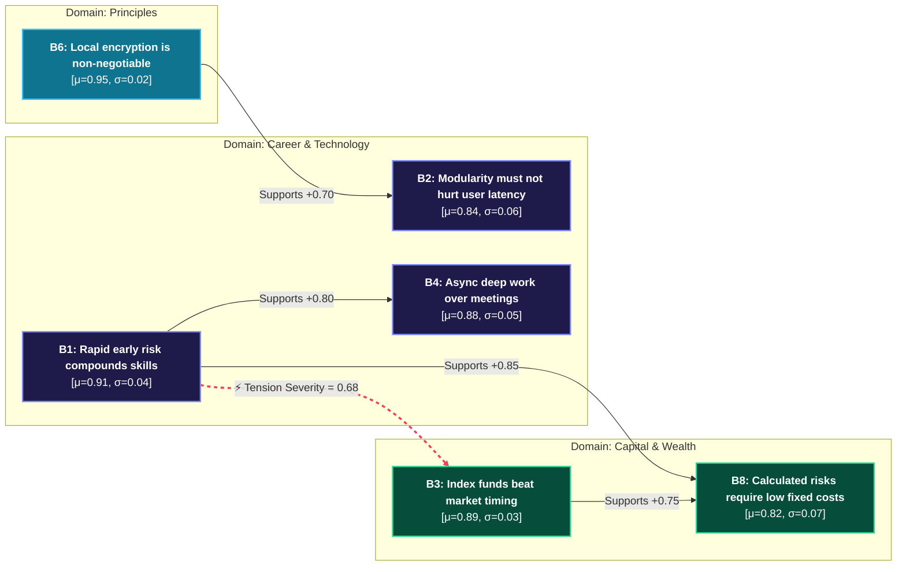

<div align="center">

```
  ██████╗ ███████╗██████╗ ███████╗ ██████╗ ███╗   ██╗ █████╗ ██╗     
  ██╔══██╗██╔════╝██╔══██╗██╔════╝██╔═══██╗████╗  ██║██╔══██╗██║     
  ██████╔╝█████╗  ██████╔╝███████╗██║   ██║██╔██╗ ██║███████║██║     
  ██╔═══╝ ██╔══╝  ██╔══██╗╚════██║██║   ██║██║╚██╗██║██╔══██║██║     
  ██║     ███████╗██║  ██║███████║╚██████╔╝██║ ╚████║██║  ██║███████╗
  ╚═╝     ╚══════╝╚═╝  ╚═╝╚══════╝ ╚═════╝ ╚═╝  ╚═══╝╚═╝  ╚═╝╚══════╝
  ██████╗ ██╗ ██████╗ ██╗████████╗ █████╗ ██╗     ████████╗██╗    ██╗██╗███╗   ██╗
  ██╔══██╗██║██╔════╝ ██║╚══██╔══╝██╔══██╗██║     ╚══██╔══╝██║    ██║██║████╗  ██║
  ██║  ██║██║██║  ███╗██║   ██║   ███████║██║        ██║   ██║ █╗ ██║██║██╔██╗ ██║
  ██║  ██║██║██║   ██║██║   ██║   ██╔══██║██║        ██║   ██║███╗██║██║██║╚██╗██║
  ██████╔╝██║╚██████╔╝██║   ██║   ██║  ██║███████╗   ██║   ╚███╔███╔╝██║██║ ╚████║
  ╚═════╝ ╚═╝ ╚═════╝ ╚═╝   ╚═╝   ╚═╝  ╚═╝╚══════╝   ╚═╝    ╚══╝╚══╝ ╚═╝╚═╝  ╚═══╝
```

### **A Sovereign Computational Mirror of Human Reasoning, Latent Values, and Decision Styles**

[](https://www.python.org/)
[](https://fastapi.tiangolo.com/)
[](https://duckdb.org/)
[](https://lancedb.com/)
[](https://en.wikipedia.org/wiki/Galois/Counter_Mode)
[](https://github.com)
[](https://github.com)
[](https://opensource.org/licenses/MIT)

<br/>

> *"Not advice. Not generic generative chat. A computational simulation of your own thinking, made legible and sovereign."*

<p align="center">
  <a href="#-the-manifesto">The Manifesto</a> •
  <a href="#-architectural-diagrams--workflows">Diagrams</a> •
  <a href="#-state-of-the-art-lavish-web-ui">Web UI</a> •
  <a href="#-quick-start">Quick Start</a> •
  <a href="#-mathematical--cognitive-foundations">Mathematical Foundations</a> •
  <a href="#-security--privacy-architecture">Security Vault</a> •
  <a href="#-rest-api-reference">API Spec</a>
</p>

---

</div>

## 🌌 The Manifesto

Most artificial intelligence systems are **epistemically general**: they compress world knowledge and apply population-level heuristics to whoever asks. When you ask a general LLM *"Should I accept this startup offer or stay at my enterprise role?"*, it responds with textbook frameworks, industry averages, and polite platitudes.

**The Personal Digital Twin (PDT) inverts this paradigm.** 

PDT is not an advisor. It is an **interpretable computational model of how YOU specifically think**. It extracts the latent objective function that drives your real-world choices, constructs an axiomatic belief graph of your convictions, maps your position on the validated Schwartz value continuum, and simulates your deliberation on novel dilemmas:

1. **Reconstructs Latent Values:** Infers what you care about from revealed preferences and decision trade-offs using **Inverse Reinforcement Learning (IRL)** rather than unreliable self-reporting.
2. **Quantifies Uncertainty Everywhere:** Every modeled parameter carries a Bayesian credible interval $[\mu - \sigma, \mu + \sigma]$. The system rejects overconfidence and explicitly signals when it is extrapolating.
3. **Surfaces Cognitive Inconsistencies:** Automatically identifies internal tensions between stated values and actual choices (e.g., claiming to prioritize work-life balance while repeatedly accepting 70-hour operational roles).
4. **Tracks Parameter Drift:** Applies Bayesian Online Changepoint Detection (BOCPD) to identify how your convictions evolve over time without erasing your historical foundation.
5. **Absolute Local Sovereignty:** Operates strictly on `127.0.0.1`. All memories, belief graphs, and reasoning traces live in an envelope-encrypted, zero-knowledge vault protected by Argon2id and AES-256-GCM.

---

## ⚖️ Paradigmatic Comparison

| Dimension | Generic LLMs & Chatbots | Persona / Prompt Tuning | Personal Digital Twin (PDT) |
| :--- | :--- | :--- | :--- |
| **Epistemic Model** | Population average heuristics | Surface tone mimicking | **Rigorous Bayesian utility & value parameterization** |
| **Value Representation** | Generic conversational alignment | Ephemeral chat context window | **Schwartz 10-Dimensional Values with Credible Intervals** |
| **Belief Structure** | Hidden weights in black-box LLM | Ad-hoc text memory | **Axiomatic Knowledge Graph with Polarity & Evidence Links** |
| **Uncertainty Tracking** | Hallucinated confidence | None (Scalar text) | **Strict variance bounds $[\mu \pm \sigma]$ on every parameter** |
| **Memory Truth** | Context summarization / lossy RAG | Fragile memory overwrites | **Append-Only Truth: DuckDB + LanceDB Native Versioning** |
| **Counterfactuals** | Hallucinated guesses | Unstable roleplay | **Mathematical Perturbation Sandboxing with IRL weights** |
| **Data Privacy** | Cloud server surveillance | Cloud vector databases | **Zero-Knowledge Argon2id + AES-256-GCM Local Vault** |

---

## 📐 Architectural Diagrams & Workflows

### 1. Complete End-to-End System Architecture



---

### 2. Decision Narration & IRL Parameter Fusion Workflow

When you narrate a decision in the Web Studio or CLI, the pipeline converts unstructured narrative into mathematical belief and value updates:



---

### 3. The Counterfactual Simulation Loop

How the Twin evaluates novel problems and tests value perturbations:



---

### 4. Schwartz Circumplex Theory of Basic Human Values

The psychological anchor of PDT is Shalom Schwartz's validated 10-dimensional value structure, modeling dynamic motivational conflicts around two orthogonal axes:



---

### 5. Probabilistic Belief Network & Cognitive Tension Topology



---

## 🖥️ State-of-the-Art Lavish Web UI

The Web Application is a custom, zero-dependency, hardware-accelerated **Single Page Application** constructed with deep obsidian glassmorphism (`backdrop-filter: blur(20px)`), modern typography (`Plus Jakarta Sans` + `JetBrains Mono`), and real-time interactive canvas graphics.

### UI Architecture & Screen Wireframe

```
====================================================================================================
 🧠 PERSONAL DIGITAL TWIN               [•] AES-GCM Vault Active    [Live Store | (*) Preview Model]
====================================================================================================
 [🌟 Executive Pulse] [🧠 Twin Sandbox] [🕸️ Belief Graph] [⚖️ Values] [⚡ Tensions] [✍️ Studio] [🔍 Vault]
----------------------------------------------------------------------------------------------------
  🌟 EXECUTIVE PULSE                                                                               
  +-----------------------+ +-----------------------+ +-----------------------+ +------------------+
  | REASONING TRACES      | | ACTIVE BELIEFS        | | CALIBRATION SCORE     | | COGNITIVE FRICTION|
  | 28                    | | 14                    | | 89.4%                 | | 2 Active Tensions|
  | +4 traces this week   | | Across 6 life domains | | Reliability beta=0.91 | | Surfaced for review|
  +-----------------------+ +-----------------------+ +-----------------------+ +------------------+
                                                                                                    
  CORE VALUE HIERARCHY (Top Bayesian Drivers)           ACTIVE COGNITIVE TENSIONS                  
  Self-Direction [========================] μ=0.88      ⚡ Autonomy vs Capital Preservation        
  Benevolence    [====================    ] μ=0.76         Your career bets show aggressive startup 
  Universalism   [==================      ] μ=0.71         appetite, while investments demand safety
  Achievement    [=================       ] μ=0.68      ⚡ Architectural Purity vs Velocity         
----------------------------------------------------------------------------------------------------
  🧠 TWIN SIMULATION SANDBOX (/twin/query)                                                          
  Dilemma Presets: [🚀 Startup vs Big Tech]  [💰 Equity Sale vs Hold]  [⚖️ Value Alignment]         
  Query Mode:      (*) Predict Choice  ( ) Counterfactual Sandbox  ( ) Explain  ( ) Value Alignment 
                                                                                                    
  [ SCENARIO COMPOSER ]                               [ PREDICTED TWIN DELIBERATION ]               
  Domain: [Career & Professional        v]            +--------------------------------------------+
  Prompt: Should I leave enterprise role to           | PREDICTED CHOICE:                          |
          become founding CTO at an AI startup?       | >> Join early-stage robotics startup (72%) |
                                                      | Confidence: 86%  [CI: 0.74 - 0.93]         |
  Options:                                            +--------------------------------------------+
  [A] Join early-stage robotics startup               | INTERNAL MONOLOGUE RATIONALE:              |
  [B] Remain in Big Tech staff engineering role       | "Given your priority of Self-Direction     |
                                                      |  (0.88) and low risk-aversion in Career,   |
  Counterfactual Perturbation Sliders:                |  Option A strongly dominates. Option B     |
  Self-Direction: [=======|=======] +0.30             |  contradicts axiom that early risk         |
  Security:       [====|==========] -0.20             |  compounds skills faster."                 |
                                                      +--------------------------------------------+
  [ EXECUTE SIMULATION ]                              | KEY CONTRIBUTING WEIGHTS:                  |
                                                      |  [self_direction: +0.44]  [security: -0.18]|
                                                      +--------------------------------------------+
                                                      | FEEDBACK LOOP ("Actually, I would..."):    |
                                                      | [ Type correction... ] [ Send Correction ] |
----------------------------------------------------------------------------------------------------
  🕸️ BELIEF KNOWLEDGE GRAPH (Interactive Canvas Engine)                                           
  Filter: [All] [Career] [Finance] [Tech] [Ethics] [Social]          [Camera: (+) Zoom  (-) Zoom  (R)]
  +-------------------------------------------------------------+ +--------------------------------+
  |              (B6: Local Encryption)                         | | BELIEF INSPECTOR DRAWER        |
  |                        |                                    | | Statement:                     |
  |                        v                                    | | "Taking smart risks early in   |
  |  (B4: Async Work) <-- (B1: Early Risk) - - - - - > (B3: ETF)| |  career compounds skills"      |
  |                             |            (Tension)          | | Domain: CAREER                 |
  |                             v                               | | Point Estimate: μ=0.91         |
  |                      (B8: Low Costs)                        | | Credible Interval: [0.86-0.95] |
  |                                                             | | Evidence: 8 historical traces  |
  +-------------------------------------------------------------+ +--------------------------------+
====================================================================================================
```

### The Seven Specialized UI Views

1. **🌟 Executive Pulse (Dashboard):** High-level cognitive vitals, recent reasoning trace telemetry, Schwartz radar, and quick system diagnostic metrics.
2. **🧠 Twin Simulation Sandbox:** Dynamic query evaluator with probability breakdown, internal monologue synthesis, counterfactual perturbation sliders, and corrective feedback loop.
3. **🕸️ Belief Knowledge Graph:** Canvas engine with interactive physics, node sizing by evidence depth, domain coloring, tension edge markers, and slide-out inspector.
4. **⚖️ Values & Decision Styles:** Schwartz 10D range bars with confidence brackets and General Decision Making Styles (Analytical, Intuitive, Spontaneous, Dependent).
5. **⚡ Cognitive Tensions & Parameter Drift:** Surfaced contradictions between stated beliefs and revealed choices, plus temporal drift changepoint logs.
6. **✍️ Decision Narration Studio:** 6-step guided reflection intake that extracts schema-validated reasoning traces into your local encrypted vault.
7. **🔍 Memory Vault & Cryptographic Privacy:** Hybrid semantic vector retrieval across LanceDB, envelope encryption inspection, and signed SHA-256 backup export.

---

## ⚡ Quick Start

### 1. Prerequisites
* **Python 3.11+** (tested up to 3.14)
* **Git**
* Windows (PowerShell), macOS, or Linux

### 2. Installation
```bash
# Clone the repository
git clone https://github.com/your-username/personal-digital-twin.git
cd personal-digital-twin

# Create virtual environment
python -m venv .venv

# Activate environment
.venv\Scripts\activate          # Windows PowerShell: .venv\Scripts\Activate.ps1
# source .venv/bin/activate     # macOS / Linux

# Install in editable mode with development & testing dependencies
pip install -e ".[dev]"
```

### 3. Configure Credentials
```bash
cp .env.example .env
```
Open `.env` in your editor and configure your LLM provider (`openai`, `anthropic`, or `mock` client for offline dev):
```env
PDT_ENV=dev
PDT_DATA_DIR=.data
PDT_LLM_PROVIDER=openai
PDT_LLM_API_KEY=your-api-key-here
PDT_LLM_MODEL=gpt-4o
PDT_EMBEDDING_MODEL=text-embedding-3-small
```

### 4. Initialize Your Encrypted Vault
```bash
pdt init
```
Prompts for a secure passphrase. Generates Argon2id salt, derives master keys, creates your `.data` directory, and initializes DuckDB and LanceDB schemas.

### 5. Validate Health Diagnostics
```bash
pdt doctor
```
Verifies directory permissions, Argon2id parameters, DuckDB Analytical engine, LanceDB Vector engine, and LLM abstraction layers.

### 6. Launch the Server & Experience the Web UI
```bash
pdt serve
```
Prompts for your passphrase to unlock the vault in memory, initializes the server, and serves the application:
* **🖥️ Main Web UI:** [http://127.0.0.1:8000/ui/](http://127.0.0.1:8000/ui/) *(or [http://127.0.0.1:8000/](http://127.0.0.1:8000/))*
* **✍️ Dedicated Narration Studio:** [http://127.0.0.1:8000/ui/narration/](http://127.0.0.1:8000/ui/narration/)
* **📚 Interactive API Documentation (Swagger):** [http://127.0.0.1:8000/docs](http://127.0.0.1:8000/docs)
* **📖 ReDoc Specification:** [http://127.0.0.1:8000/redoc](http://127.0.0.1:8000/redoc)

---

## 🔬 Mathematical & Cognitive Foundations

### 1. Maximum Entropy Inverse Reinforcement Learning (BIRL)
Given an observed human decision $y \in \mathcal{A}$ in context $s$, classical RL assumes an agent maximizes an external reward. PDT inverts this: we observe decisions $y$ and infer the human's latent reward parameter vector $\theta$:

$$P(y \mid s, \theta) = \frac{\exp(\beta \cdot U(y, s; \theta))}{\sum_{y' \in \mathcal{A}} \exp(\beta \cdot U(y', s; \theta))}$$

Where:
* $\theta \in \mathbb{R}^{10}$ represents weights across Schwartz value dimensions.
* $U(y, s; \theta) = \theta^T \phi(y, s)$ is the multi-attribute utility function.
* $\phi(y, s)$ is the feature vector of option $y$.
* $\beta \in (0, \infty)$ is the rationality coefficient (modeling human bounded rationality).

Optimization maximizes the entropy of the distribution $H(\pi_\theta)$ subject to matching feature expectations:

$$\max_{\theta} H(\pi_\theta) \quad \text{subject to} \quad \mathbb{E}_{\pi_\theta}[\phi(y, s)] \approx \mathbb{E}_{\text{observed}}[\phi(y, s)]$$

### 2. Bayesian Credible Intervals & Uncertainty Thresholding
Every estimated parameter is stored not as a naive scalar, but as a probability distribution:

$$\theta_i \sim \mathcal{N}\left(\hat{\mu}_i, \, \hat{\sigma}^2_i\right) \quad \text{with 95\% CI: } \left[\hat{\mu}_i - 1.96\hat{\sigma}_i, \, \hat{\mu}_i + 1.96\hat{\sigma}_i\right]$$

When the twin answers a simulation query, it propagates parameter uncertainty through Monte Carlo samples. If the standard deviation $\sigma_i$ exceeds a domain confidence threshold $\tau_{\text{extrap}}$, the twin explicitly emits an `extrapolation_flag` warning the user that it is reasoning outside observed territory.

### 3. Bayesian Online Changepoint Detection (BOCPD)
To differentiate temporary behavioral noise from genuine personality evolution, the twin evaluates the run-length $r_t$ since the last changepoint for each parameter time-series:

$$P(r_t \mid x_{1:t}) = \frac{\sum_{r_{t-1}} P(r_t \mid r_{t-1}) P(x_t \mid r_{t-1}, x_t^{(r)}) P(r_{t-1} \mid x_{1:t-1})}{P(x_{1:t})}$$

When $P(r_t = 0 \mid x_{1:t})$ exceeds significance threshold $\alpha=0.05$, a changepoint event is recorded in the `drift_log`, alerting the user that their decision style has systematically transformed.

---

## 🔒 Security & Privacy Architecture

The Personal Digital Twin handles intimate psychological and biographical data. Its security model is **zero-trust and local-first**:

```
+---------------------------------------------------------------------------------+
|                                USER PASSPHRASE                                  |
+---------------------------------------------------------------------------------+
                                        │
                                        ▼ Argon2id KDF
                        (Memory: 64 MiB, Iterations: 3, Threads: 4)
                                        │
                                        ▼
+---------------------------------------------------------------------------------+
|                             32-BYTE MASTER KEY                                  |
|                 (Held Ephemerally in RAM • Never Written to Disk)                |
+---------------------------------------------------------------------------------+
                                        │
                    ┌───────────────────┴───────────────────┐
                    ▼                                       ▼
        [ DuckDB Envelope Encryption ]            [ LanceDB Cryptographic Access ]
     - App-level AES-256-GCM                   - Local vector snapshot partitions
     - Unique 12-byte IV per row payload       - Sensitive metadata ciphered
     - Authenticated tag verification          - Zero external telemetry
```

* **No SQLite:** DuckDB serves analytical relational queries with encrypted columnar payloads.
* **No Database Daemon:** Both DuckDB and LanceDB are embedded in-process. No listening ports except the local FastAPI daemon on `127.0.0.1`.
* **Zero Telemetry by Default:** Consult and query event logging are consent-gated on explicit `"usage"` permissions.
* **Signed Export Verification:** When exporting via `/export`, the complete bundle is SHA-256 hashed and cryptographically signed for offline verification.

---

## 💻 CLI Command Reference

The `pdt` command-line interface provides full control without opening a browser:

```bash
# Initialize encrypted vault with passphrase
pdt init

# Comprehensive system health checks
pdt doctor

# Interactive Decision Narration (walks through structured reflection)
pdt narrate

# Launch FastAPI daemon and Web UI
pdt serve --host 127.0.0.1 --port 8000

# Inspect model summary
pdt inspect

# Query twin simulation directly from terminal
pdt query "Should I relocate for a new role?" --domain career
```

---

## 📡 REST API Reference

| Method | Endpoint | Description | Request Body | Response Model |
| :--- | :--- | :--- | :--- | :--- |
| `GET` | `/health` | System health & vault presence | None | `HealthResponse` |
| `POST` | `/narration/start` | Start new narration session | None | `NarrationStartResponse` |
| `POST` | `/narration/{id}/submit` | Extract trace & commit encrypted record | `NarrationSubmitRequest` | `NarrationSubmitResponse` |
| `GET` | `/twin/model` | Complete twin state (beliefs, values, tensions) | None | `TwinModelResponse` |
| `POST` | `/twin/query` | Run simulation / counterfactual query | `TwinQueryRequest` | `TwinQueryResponse` |
| `POST` | `/twin/feedback` | User correction feedback loop | `TwinFeedbackRequest` | `FeedbackResult` |
| `GET` | `/model/summary` | Summary of values & decision styles | None | `ModelSummaryResponse` |
| `GET` | `/model/beliefs` | Belief graph nodes & edges | None | `BeliefsResponse` |
| `GET` | `/model/values` | Schwartz value hierarchy with CIs | None | `ValuesResponse` |
| `GET` | `/model/tensions` | Surface active cognitive tensions | None | `TensionsResponse` |
| `GET` | `/model/drift` | Parameter drift changepoint logs | None | `DriftSummaryResponse` |
| `POST` | `/retrieve` | Hybrid semantic vector memory query | `RetrievalRequest` | `RetrievalResponse` |
| `GET` | `/export` | Signed zero-knowledge backup export | None | `ExportResponse` |
| `DELETE`| `/model` | Cryptographic erase & audit tombstone | None | `DeleteModelResponse` |

---

## 🧪 Testing & Quality Assurance Suite

PDT adheres to strict quality benchmarks enforced in CI:

```bash
# Run pytest test suite (167 tests, 91% branch coverage gate)
pytest

# Strict type checking on core packages
mypy

# Architecture boundary enforcement
lint-imports

# Code formatting and linting
ruff check src tests
ruff format --check src tests
```

---

## 📚 Theoretical References

1. **Schwartz, S. H. (1992, 2012).** *An Overview of the Schwartz Theory of Basic Values.* Online Readings in Psychology and Culture, 2(1).
2. **Ziebart, B. D., Maas, A. L., Bagnell, J. A., & Dey, A. K. (2008).** *Maximum Entropy Inverse Reinforcement Learning.* Proc. AAAI.
3. **Adams, R. P., & MacKay, D. J. (2007).** *Bayesian Online Changepoint Detection.* arXiv:0710.3742.
4. **Scott, S. G., & Bruce, R. A. (1995).** *Decision-Making Style: The Development and Assessment of a New Measure.* Educational and Psychological Measurement, 55(5), 818–831.
5. **Kahneman, D., & Tversky, A. (1979).** *Prospect Theory: An Analysis of Decision under Risk.* Econometrica, 47(2), 263–291.

---

## 📄 License

Distributed under the **MIT License**. See [`LICENSE`](LICENSE) for full details.
