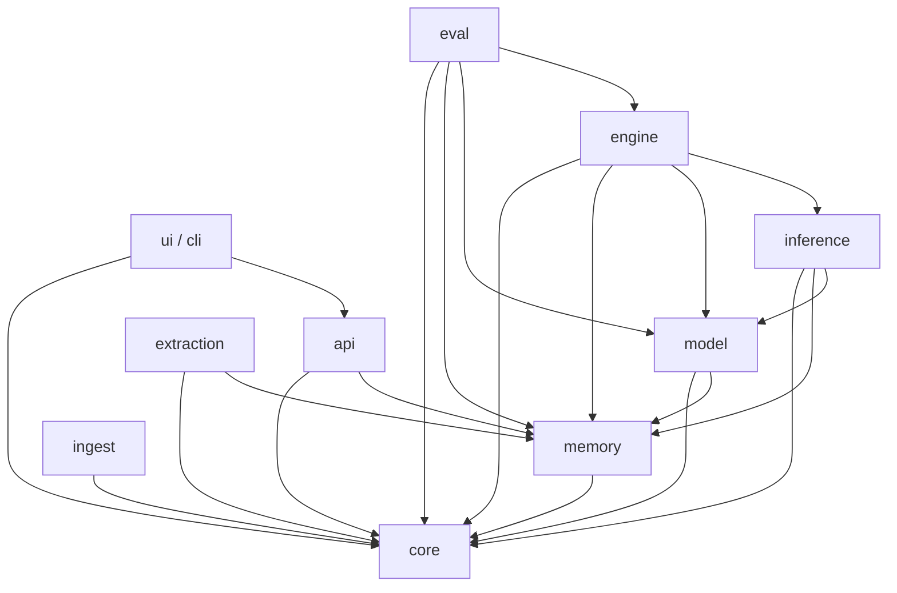

# Architecture

Phase 0 establishes the local-first layered skeleton for the Personal Digital Twin.

## Layered structure

## Responsibilities

- `core/`: configuration, crypto, schemas, and the single LLM abstraction.
- `memory/structured/`: append-only DuckDB store with encrypted payload columns.
- `memory/vector/`: LanceDB vector store with version history and nearest-neighbor retrieval.
- `api/`: FastAPI app and dev-only storage round-trip endpoints.
- `ui/cli/`: user-facing command surface (`pdt init`, `pdt doctor`, `pdt serve`).
- `ingest/`, `extraction/`, `model/`, `inference/`, `engine/`, `eval/`: reserved phase packages so later work lands in the intended architecture instead of accumulating in `core/` or `api/`.

## Non-negotiable rules

1. All LLM/provider access goes through `src/pdt/core/llm/`.
2. Personal truth is append-only: no in-place updates to traces, params, beliefs, drift, or events.
3. Sensitive payloads are encrypted before they are written to disk.
4. Prompts are versioned files loaded by logical id and version.
5. Every modeled scalar must include uncertainty metadata.

## Storage overview

### Structured store

- Engine: DuckDB
- Mode: embedded, in-process
- Encryption: app-level AES-GCM envelope encryption
- Append-only tables: `traces`, `model_params`, `beliefs`, `belief_edges`, `drift_log`, `events`

### Vector store

- Engine: LanceDB
- Mode: embedded, in-process
- Retrieval: top-K similarity search
- History: version snapshots preserved and queryable via table-version lookups
- Drift safety: every row stores `embedding_model`
